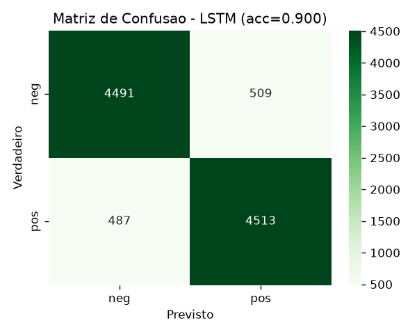

# Quantum Commerce — Análise de Sentimento em Reviews

**Disciplina:** AI Foundation and Learning Models — FIAP MBA (turma 1AIER)
**Desafio escolhido:** Análise de sentimento em reviews
**Integrantes:** _________________________________

---

## 1. Introdução e Problemática

A Quantum Commerce é uma gigante nativa digital do varejo omnicanal, presente em
12 países e com um catálogo que supera 5 milhões de SKUs. Nessa escala, a empresa
enfrenta o que internamente chama de "muro da escalabilidade operacional": manter
a qualidade do suporte ao cliente e a leitura do mercado por métodos manuais
tornou-se inviável.

Um dos sintomas mais claros desse muro está nas **avaliações de clientes**. São
dezenas de milhares de reviews por dia, espalhadas por produtos e categorias.
Lê-las uma a uma é impossível, mas dentro delas está uma informação valiosíssima:
o cliente está satisfeito ou insatisfeito?

O desafio que este trabalho endereça é justamente esse: construir um modelo capaz
de **classificar automaticamente cada avaliação como positiva ou negativa**,
transformando texto livre em um **termômetro de satisfação** por produto e por
categoria.

Por que isso é relevante para o negócio:

- **Priorização do suporte:** avaliações negativas podem ser detectadas e
  encaminhadas em tempo real, antes de virarem churn.
- **Detecção precoce de problemas:** uma queda súbita de sentimento em um produto
  sinaliza defeito, anúncio enganoso ou problema logístico.
- **Métrica contínua de satisfação:** acompanhar o sentimento médio por categoria
  vira um indicador de saúde do negócio, atualizado sozinho.
- **Insumo para outras áreas:** o sinal de sentimento alimenta recomendação,
  curadoria de catálogo e marketing.

## 2. Motivação e Justificativa da Arquitetura

A tarefa é uma **classificação binária de texto**. Ao longo da disciplina vimos
vários caminhos possíveis para resolvê-la; abaixo comparamos os principais e
explicamos a escolha.

| Abordagem | O que captura | Limitação | Custo |
|---|---|---|---|
| TF-IDF + SVM linear (Aulas 2 e 3) | frequência/importância de termos | ignora a **ordem** e o contexto das palavras | baixíssimo |
| word2vec + SVM (Aula 3) | **semântica** das palavras (sinônimos próximos) | ao tirar a média dos vetores, ainda perde a ordem | baixo |
| **LSTM (Aulas 3 e 6)** | a review como **sequência**, com memória de contexto | treino mais lento que os clássicos | médio |
| Transformers / BERT (Aula 7) | contexto bidirecional profundo | fine-tuning caro, exige GPU | alto |

O ponto central é a **ordem das palavras**. Um modelo de "saco de palavras"
(TF-IDF) trata "not good, terrible" e "not terrible, good" praticamente igual,
porque só conta termos. Já uma **rede recorrente LSTM** processa a frase da
esquerda para a direita mantendo uma "memória" do que veio antes — é capaz de
perceber negações e construções que mudam o sentido.

Escolhemos a **LSTM** porque ela é o melhor **equilíbrio** entre três fatores:

1. **Capacidade:** captura ordem e contexto, onde os modelos clássicos falham.
2. **Custo:** treina em CPU com uma amostra, ao contrário de um BERT.
3. **Aderência à disciplina:** é exatamente a arquitetura de análise de
   sentimento estudada nas aulas, e pertence à família de modelos sequenciais
   que evolui naturalmente para os transformers.

Para reforçar a comparação, implementamos também o baseline **TF-IDF + SVM** e
medimos os dois com os mesmos dados de teste (resultados na Seção 3).

## 3. Proposta de Solução

### 3.1. Dados

Usamos o dataset público **Amazon Review Polarity**, em que cada review é rotulada
como negativa (classe 1) ou positiva (classe 2). A base é balanceada e grande:
3,6 milhões de exemplos de treino e 400 mil de teste.

Como o objetivo é demonstrar a solução (e não bater recorde), e todo o treino roda
em CPU, trabalhamos com uma **amostra estratificada** de **50.000 reviews de treino
e 10.000 de teste**, mantendo o equilíbrio 50/50 entre as classes. Essa amostra é
suficiente para uma acurácia alta e mantém o treino na casa dos minutos.

### 3.2. Pipeline (do texto bruto ao modelo)

O projeto está organizado em etapas numeradas, cada uma um script Python:

1. **Amostragem** — extrai a amostra balanceada do dataset completo.
2. **Pré-processamento** — coloca em minúsculas, remove pontuação, tokeniza,
   constrói o vocabulário (**apenas com o treino**, para não vazar informação do
   teste) e aplica *padding* (todas as sequências com 200 tokens).
3. **word2vec** — treina embeddings (skip-gram, 200 dimensões) no próprio corpus;
   esses vetores **inicializam** a camada de embedding da rede.
4. **Treino da LSTM** — a arquitetura é:

   `Embedding(vocabulário, 200) → LSTM(hidden=128, 2 camadas, dropout=0.5) → Dropout(0.3) → Linear(128→1) → Sigmoide`

   Treinada com perda **BCELoss**, otimizador **Adam** (lr = 0,001), 4 épocas,
   lotes de 128 e *gradient clipping*; 10% do treino são reservados para
   **validação**, e guardamos o **melhor modelo** (menor perda de validação) via *checkpoint*.
   O treino e a avaliação são rastreados com o **Weights & Biases**: hiperparâmetros,
   curvas de perda de treino vs. validação por época e as métricas finais ficam
   registrados no dashboard.
5. **Avaliação** — mede acurácia, precisão, recall, F1 e a matriz de confusão no
   conjunto de teste (10 mil reviews nunca vistas).
6. **Inferência** — dada uma review nova, devolve a probabilidade de ser positiva.

O word2vec, sozinho, já mostra que aprendeu a semântica do domínio. Alguns
vizinhos mais próximos aprendidos no corpus:

- `terrible` ≈ horrible, awful, horrendous
- `great` ≈ terrific, fantastic, wonderful
- `bad` ≈ horrible, terrible, shabby

### 3.3. Resultados

Comparação no conjunto de teste (10.000 reviews):

| Modelo | Acurácia | Precisão | Recall | F1 |
|---|---|---|---|---|
| TF-IDF + SVM (baseline) | 0,8849 | 0,8851 | 0,8849 | 0,8849 |
| **LSTM (word2vec)** | 0,9004 | 0,9004 | 0,9004 | 0,9004 |

A LSTM superou o baseline clássico, ainda que por uma margem pequena (cerca de 1,5
pontos de acurácia). Em um benchmark grande, balanceado e relativamente fácil como
este, o TF-IDF + SVM já é um adversário forte; mesmo assim, a rede sequencial
entrega o melhor resultado e, sobretudo, captura o **contexto** das palavras —
vantagem que tende a crescer em casos mais difíceis (negação, ironia, frases
longas). Um detalhe importante do treino: a LSTM atingiu seu melhor ponto na
3ª época; depois disso, a perda de treino continuou caindo enquanto a de validação
voltou a subir — sinal clássico de **overfitting**. Por isso guardamos o melhor
modelo (menor perda de validação) via *checkpoint*, em vez do modelo da última época.
As curvas registradas no W&B tornam esse ponto de virada visível a olho e
fundamentam a escolha do checkpoint.

Matriz de confusão da LSTM:



Exemplos de inferência em frases novas:

```
[POSITIVO] p=0.994  "This product is amazing, exactly what I needed. Highly recommend!"
[NEGATIVO] p=0.003  "Terrible quality, it broke after one day. Complete waste of money."
[POSITIVO] p=0.987  "Absolutely love it, best purchase I have made this year."
[NEGATIVO] p=0.009  "Worst customer service ever, I will never buy here again."
[POSITIVO] p=0.669  "It works fine, nothing special but it does the job."
```

### 3.4. Como o resultado é consumido

O modelo treinado é um arquivo leve que roda em CPU. Em produção, ele seria
exposto como um **serviço** que recebe o texto de uma avaliação e devolve
`{rótulo, probabilidade}`. A partir daí:

- avaliações negativas disparam **alertas** e entram na fila prioritária de suporte;
- o sentimento é **agregado por produto/categoria**, formando o termômetro;
- todo o histórico pode ser **reprocessado em lote** para gerar a métrica inicial.

## 4. Considerações e Potencial de Impacto

**Potencial de valor:** automatizar o termômetro de satisfação em escala, reduzir
o tempo de resposta a problemas, diminuir churn e alimentar recomendação e
curadoria de catálogo com um sinal que hoje está "preso" no texto das reviews.

**Limitações e riscos:**

- **Idioma:** o modelo foi treinado em inglês. Para o português, é preciso treinar
  com dados e embeddings em pt-BR.
- **Binário:** classifica apenas positivo/negativo; reviews neutras (nota 3 foram
  excluídas do dataset) e ironia continuam difíceis.
- **Mudança de domínio:** reviews da Amazon não são idênticas às da Quantum
  Commerce; em produção, o modelo deve ser re-treinado com dados próprios.
- **Vocabulário fixo:** palavras novas (gírias, produtos lançados) viram
  "desconhecidas"; isso pede re-treino periódico.
- **Viés dos dados:** o modelo herda vieses presentes nas avaliações; é preciso
  monitorar.

**Evolução natural:** fazer *fine-tuning* de um transformer (BERT ou um modelo
multilíngue) para ganhar qualidade; ou evoluir para um modelo multi-classe
(estrelas de 1 a 5) e para **análise por aspecto** (sentimento separado para
entrega, qualidade, preço).

**Conclusão:** a LSTM com embeddings word2vec demonstra, de ponta a ponta, uma
solução viável e fundamentada para o termômetro de satisfação da Quantum Commerce
— com acurácia comparável ao baseline clássico, capacidade de capturar o contexto
das palavras e uma arquitetura pronta para evoluir rumo ao estado da arte.
